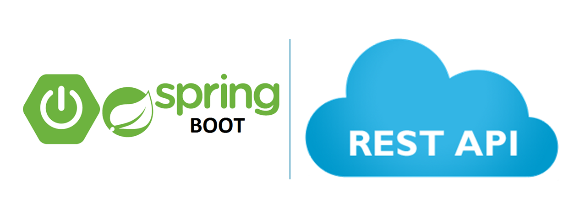
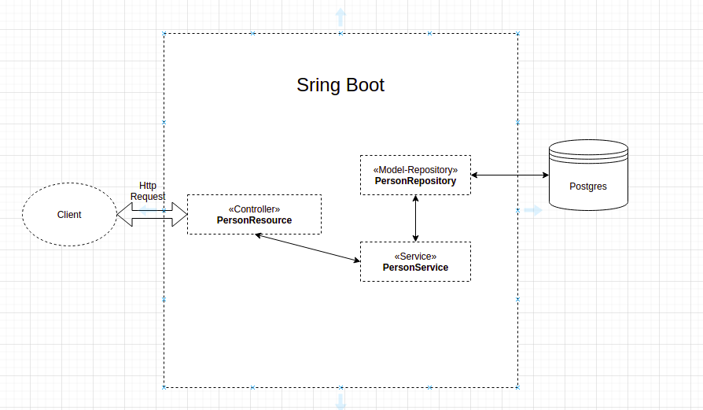

  

# REST services with Spring Boot

Developed by 

If you want, read the reference documentation about [Spring Boot](https://docs.spring.io/spring-boot/docs/current/reference/htmlsingle/)

## About the application

This repository contains an example REST Services with Spring Boot.

The purpose of the application is:
* Access and manipulate information in a Postgres Database from a set of methods to create (POST), read (GET), change (PUT) and delete (DELETE), by HTTP messages.
* This application run embedded inside the docker container.

## Developed With

* **Spring Boot** Java framework used to create a micro Service.
* Database **PostgreSQL** to store the data.
* **Docker** to package and run applications inside a container.
* **Maven** as Dependency Management System, and **Lombok Java library** to improve productivity.
* **Eclipse** as IDE.

## Architecture

* The following illustration shows the application architecture.

  

## Database table

The table contains three fields as follow:
  * ID: sequential number that will be the primary key in the database.
  * NAME: 50 characters.
  * CPF: 11 characters.

## How to run application using Docker
* If you don't have Docker, please install Docker:
[Docker Desktop](https://docs.docker.com/get-docker/) or [Docker basics for Amazon ECS](https://docs.aws.amazon.com/AmazonECS/latest/userguide/docker-basics.html).
* Run on the terminal:

		`sudo docker pull projetquebec/rest-api:0.0.1-SNAPSHOT`

		`docker run --network="host" projetquebec/rest-api:0.0.1-SNAPSHOT`

## How to develop
* You will need a Windows or Linux with Java/OpenJDK.
* Application is using Maven, so all required libraries should be downloaded automatically.
* Clone the git repository using the URL on the Github home page:

		`$ git clone git@github.com:ralexandre11/restApiCpf.git`

		`$ cd restApiCpf`

* To buid the image Docker, use the command:

		`$ mvn package`

* use the docker command to run in the topic above.

## dockerhub

You can access the respository [here](https://hub.docker.com/repository/docker/rest-api).

## Front-end Project

You can access the respository [here](https://github.com/ralexandre11/app-react-cpf).
